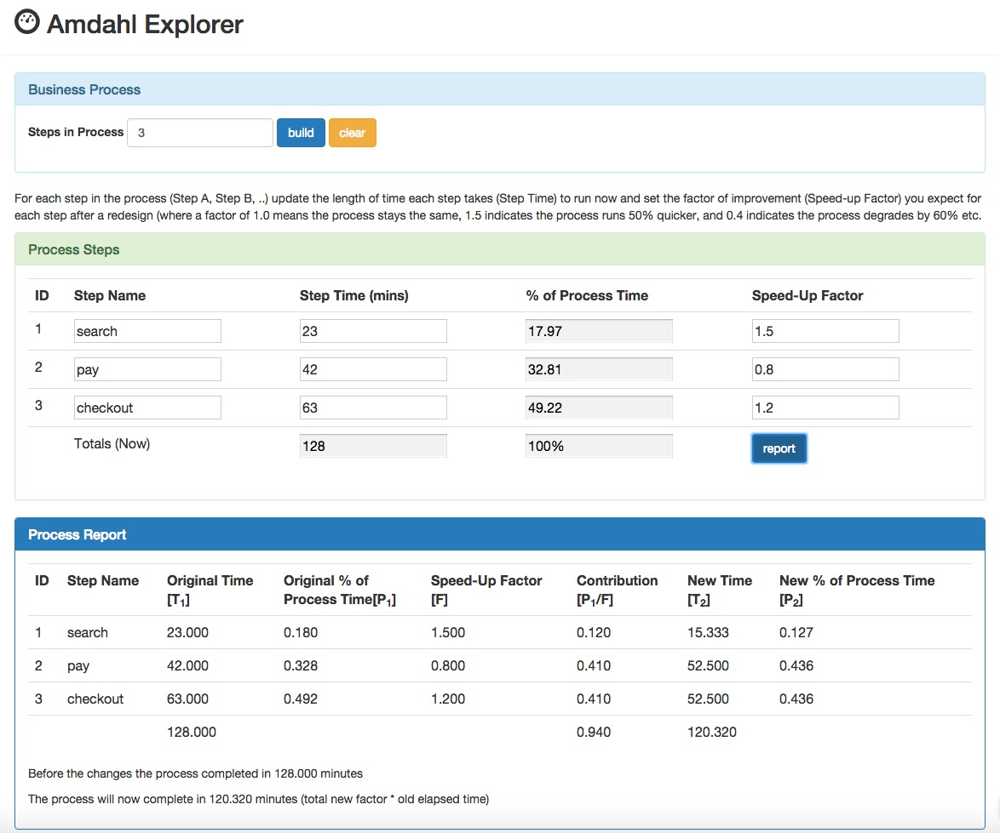

# Amdahl's Law Explorer

Source code and test html page for the Amdahl's Law Calculator from the [blog post](http://www.julianbrowne.com/article/viewer/amdahls-law) of the same name.

Or just [try it out](http://julianbrowne.github.io/amdahls-law/) in your browser.

(uses jQuery 2.x so no support for IE 6,7,8)

