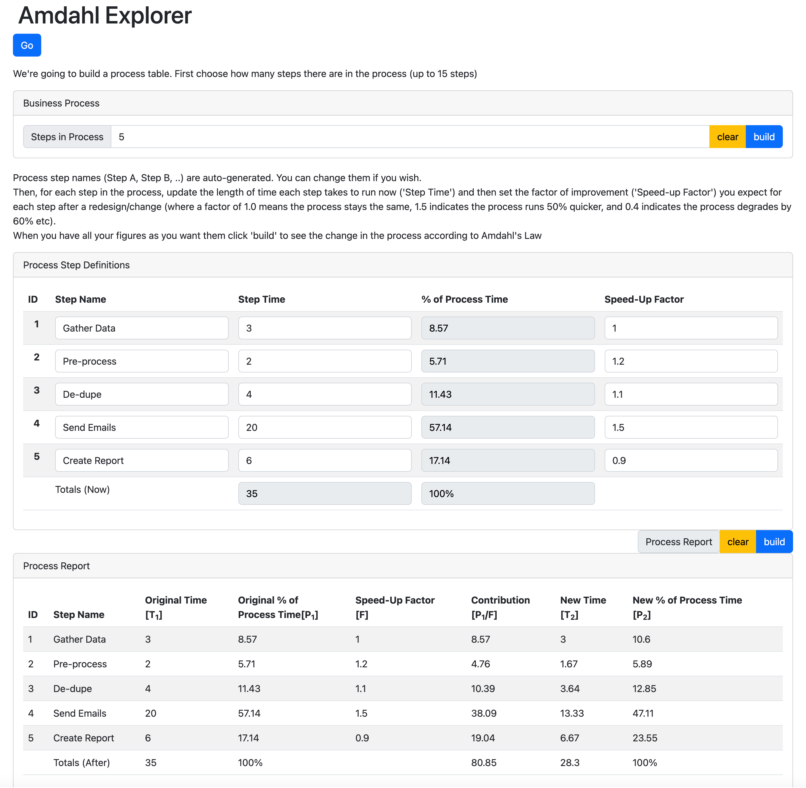

# Amdahl's Law Explorer

Source code and test html page for the Amdahl's Law Calculator from the [blog post](https://www.julianbrowne.com/article/amdahls-law/) of the same name.

Or just [try it out](http://julianbrowne.github.io/amdahls-law/test) in your browser.

## Installation

`git clone https://github.com/julianbrowne/amdahls-law`

`npm install`

## Build

`npm run build`

## Test

`npm run test`

## Test then Build

`npm run jfdi`
